# DQ77KB-I5-3475S-Hackintosh

```shell
处理器：i5-3475s
主板：Intel DQ77KB
硬盘：Lenovo SSD SL700 256G
内存：三星 DDR3 1600 8G * 2
WIFI/蓝牙：BCM94352HMB
散热器：ID-COOLING IS-20i
机箱：立人 E-T3 Thin-ITX
```

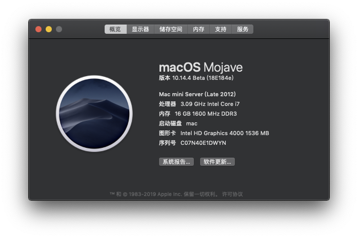

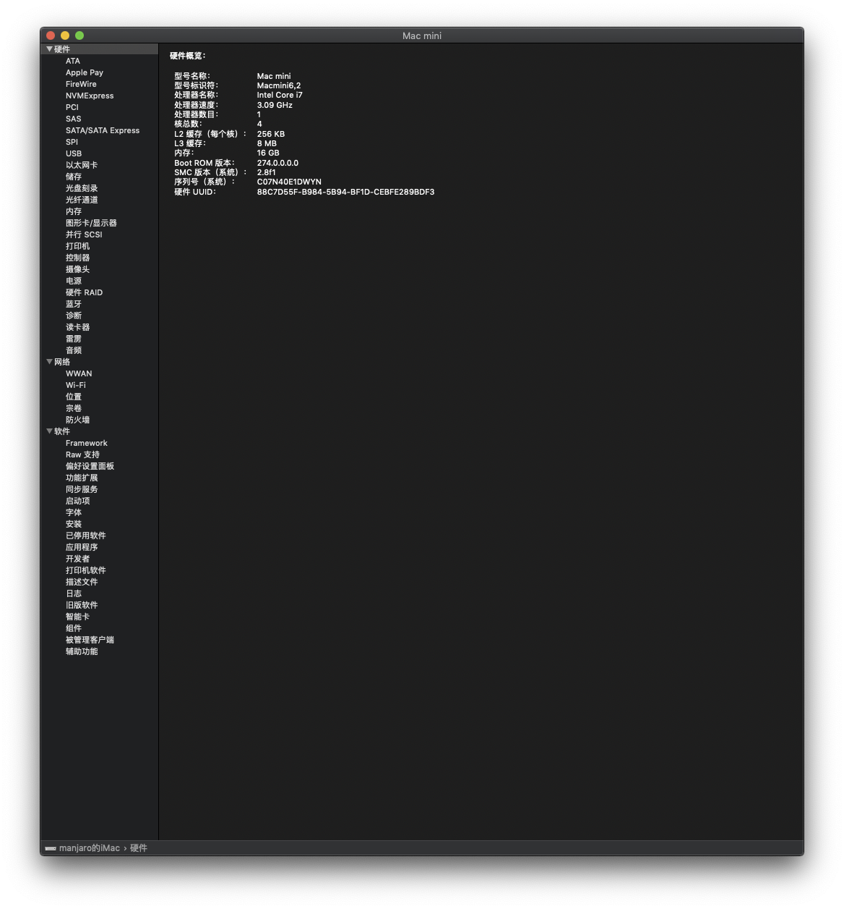

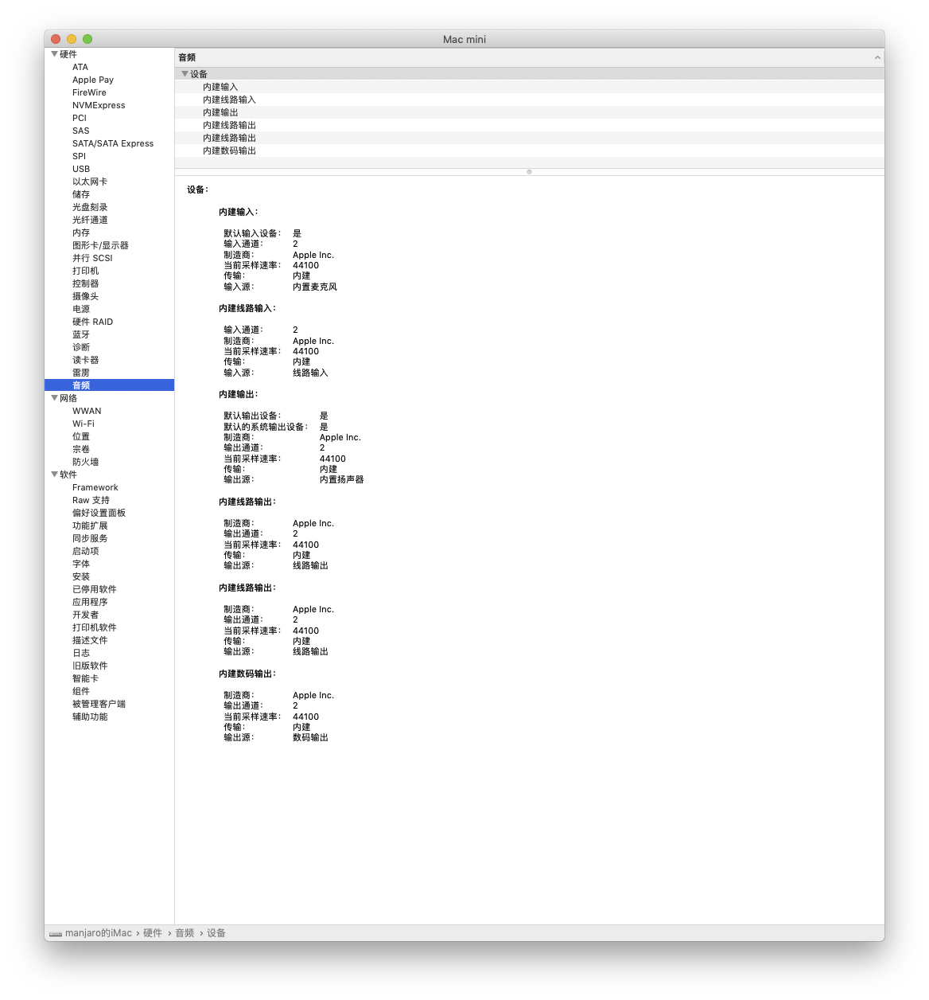

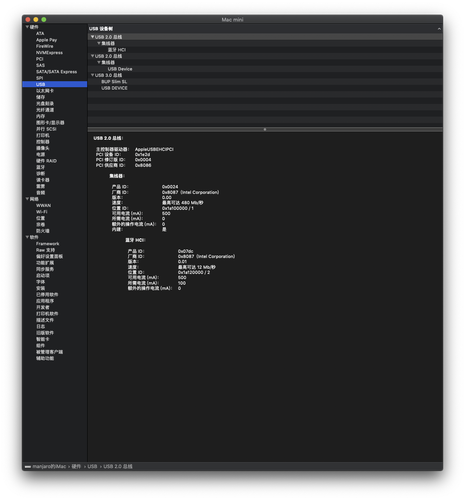

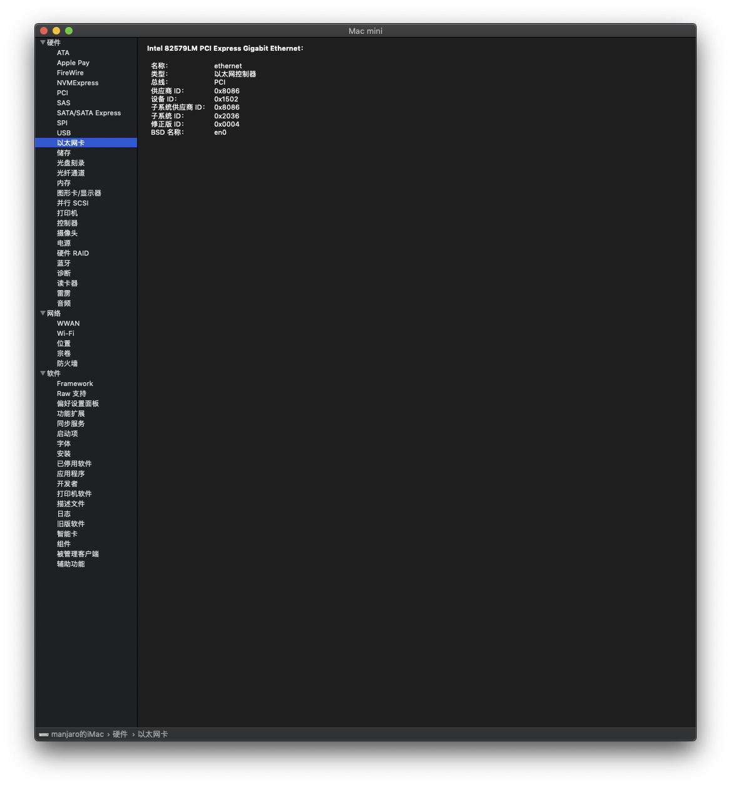

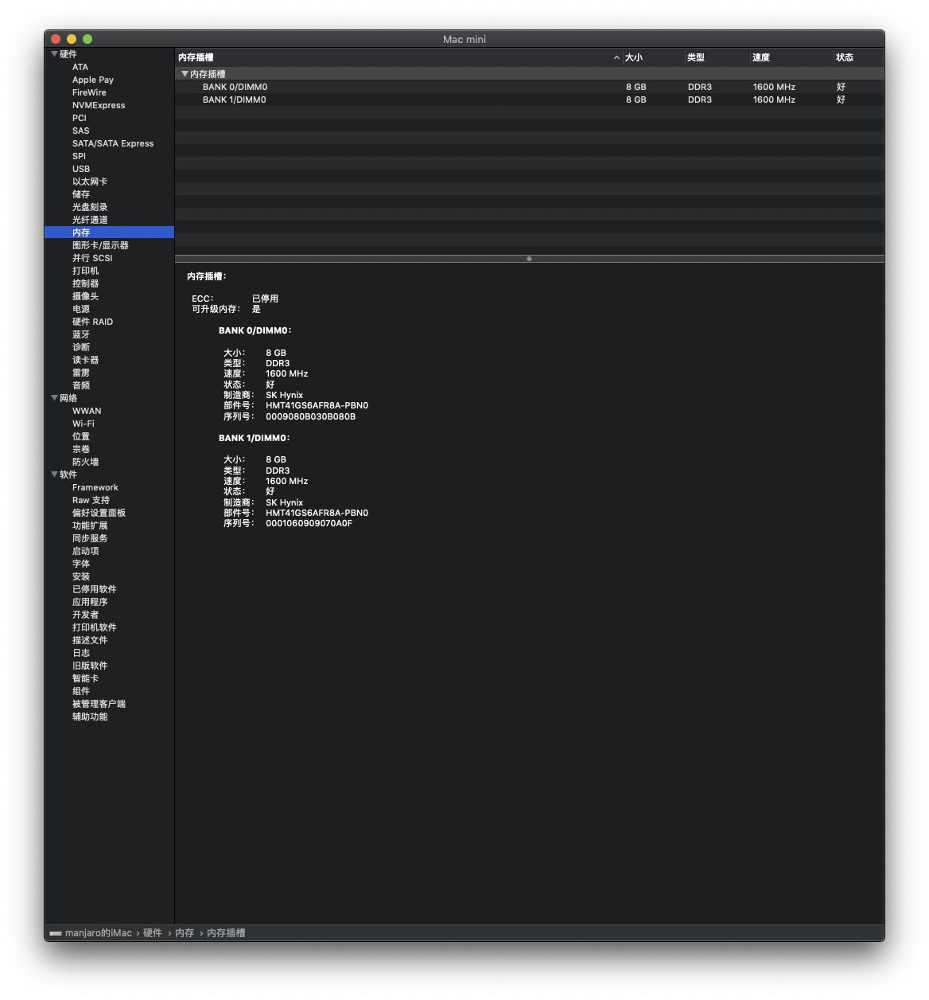

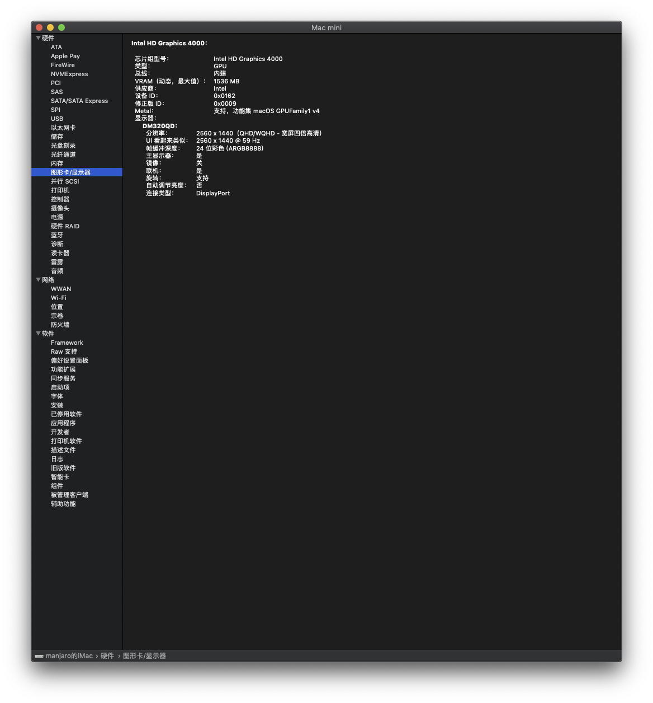

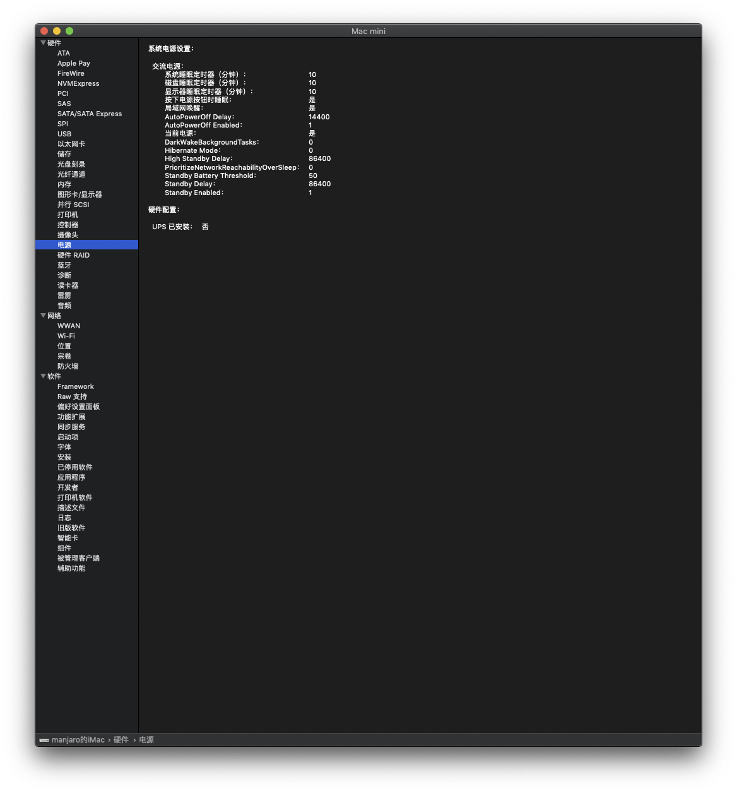

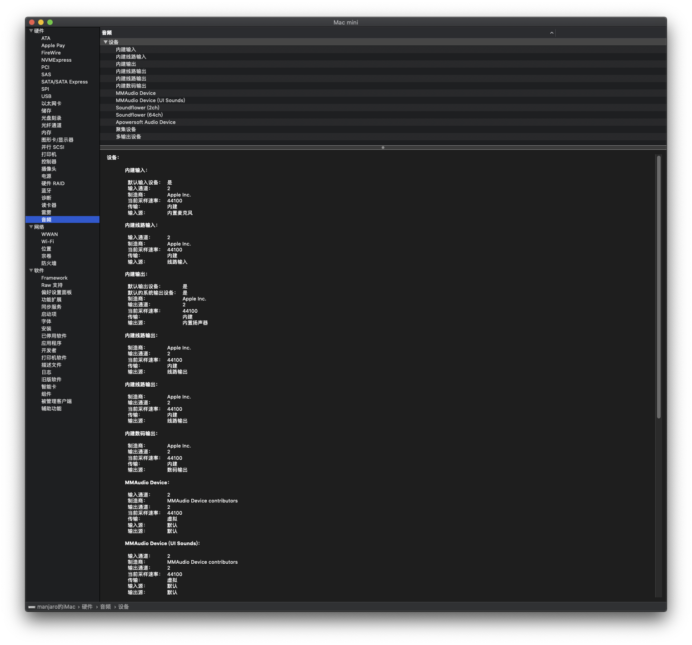

## SMBIOS

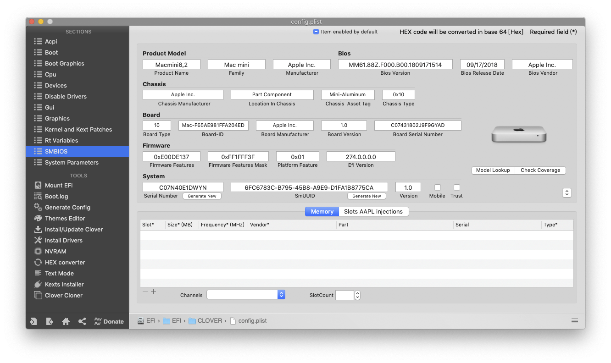

## geekbench

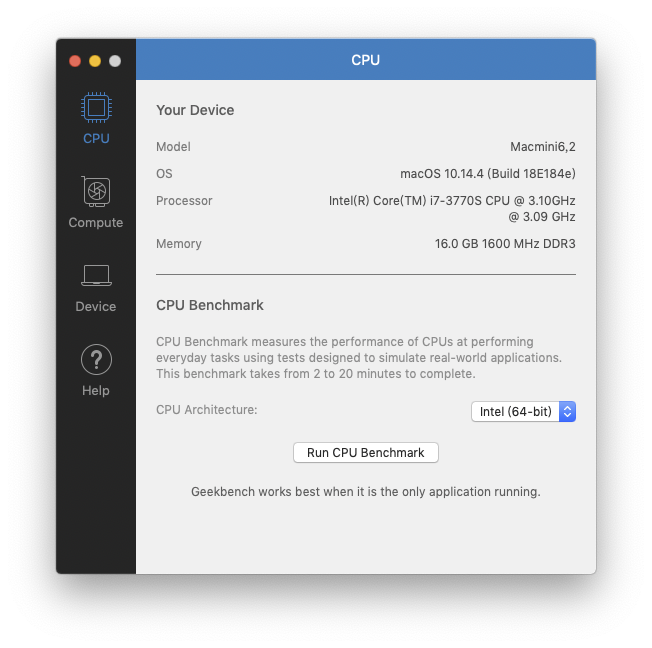

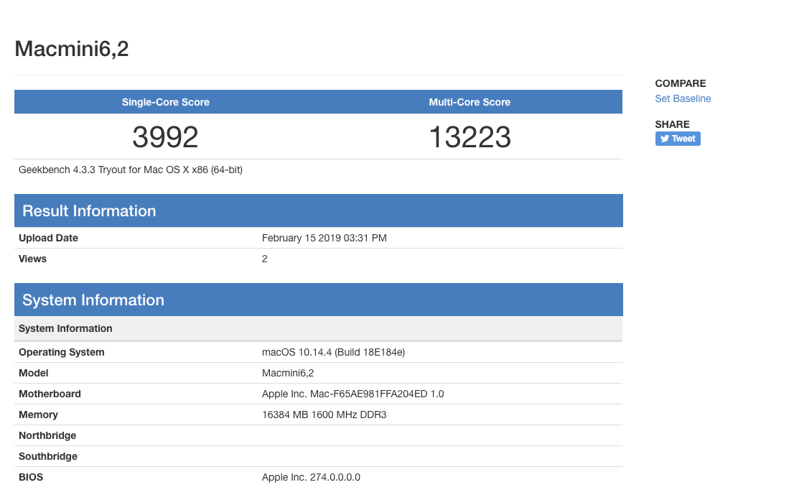

[geekbench](https://browser.geekbench.com/v4/cpu/12060887)
